# Metal Part Lifespan Prediction & Defect Classification

This repository contains a complete machine learning workflow applied to a metal manufacturing dataset. The tasks include:

- Regression: Predicting the lifespan of metal parts  
- Binary Classification: Classifying parts as defective vs non-defective  
- Convolutional Neural Networks: Classifying defect types from images  
- Clustering: Unsupervised grouping based on cooling rate, defects, and lifespan  

All results and plots are included to support the analysis.

---

# Dataset

The tabular dataset used in this project is provided as part of the coursework:

**File:** `COMP1801_CourseworkDataset1_tabular.csv`  
**Records:** 1000  
**Features:** 6 numerical, 4 categorical  
**Target:** Numerical `Lifespan`

Features include:  
CoolingRate, QuenchTime, ForgeTime, smallDefects, largeDefects, sliverDefects, microstructure, castType, partType, seedLocation.

---

# Exploratory Data Analysis (EDA)

### Dataset Head
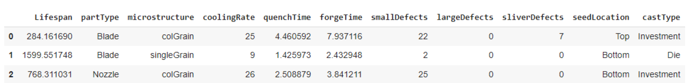

### Feature Summary
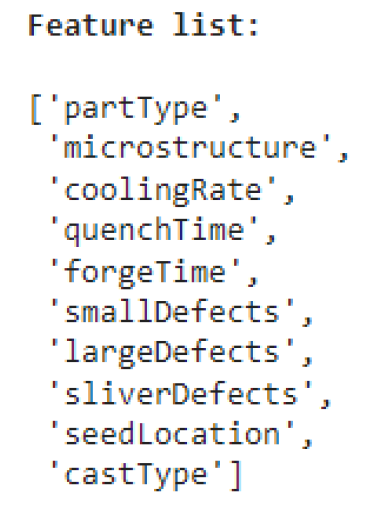

### Data Types
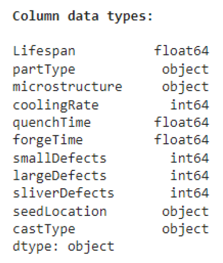

### Missing Values
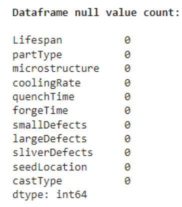

### Categorical Feature Counts
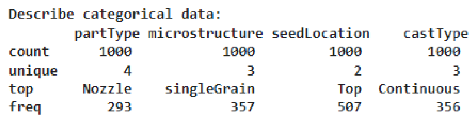

### Numerical Feature Statistics
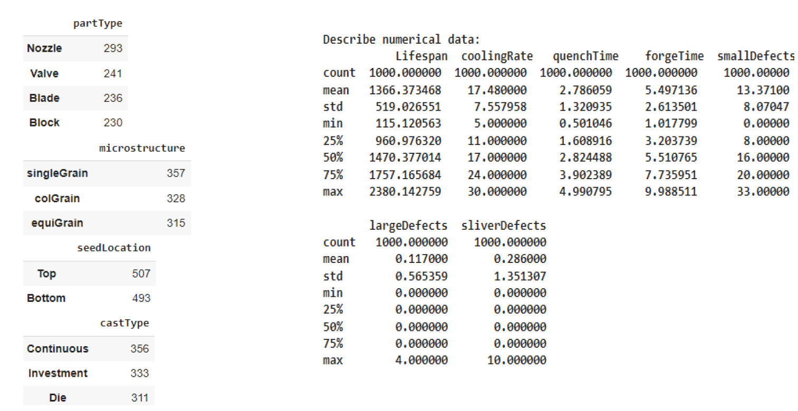

---

# Correlation & Feature Analysis

### Correlation Heatmap
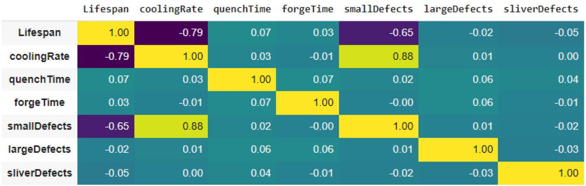

Key findings:  
- CoolingRate has a strong negative correlation with Lifespan (-0.79)  
- smallDefects negatively correlates with Lifespan (-0.65)  

### Categorical Feature Impact
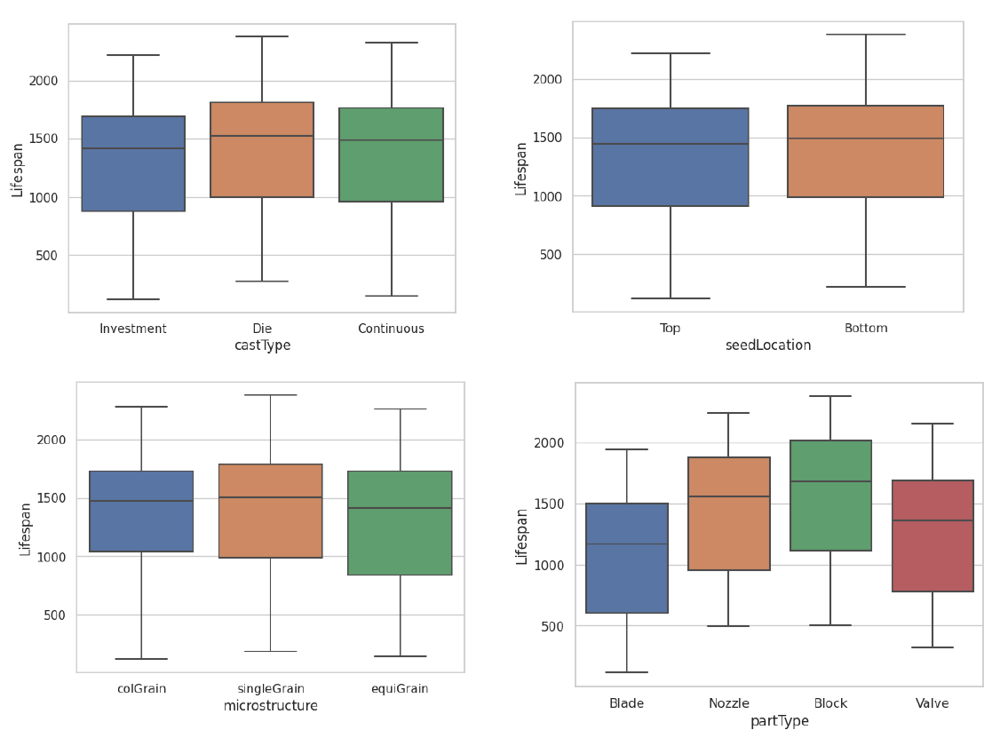

---

# Outliers

### Outlier Distributions
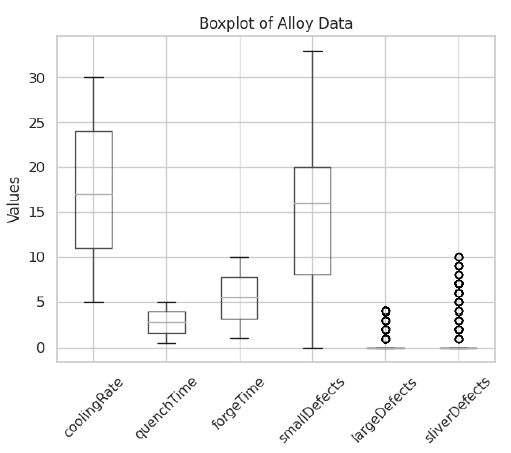

Outliers were kept because they provide meaningful signals for the models.

---

# Data Splitting & Preprocessing

- Train : Validation : Test = **8 : 1 : 1**  
- Stratified sampling for classification  
- StandardScaler for numerical features  
- One-hot encoding for categorical features  
- Label encoding for binary targets  

---

# Regression: Predicting Lifespan

Models tested: Linear, Ridge, Lasso, Random Forest.

### Performance Summary

| Model | R² | Val MSE | Test MSE |
|-------|-----|----------|-----------|
| Linear Regression | 0.9136 | 24854 | 24944 |
| Ridge Regression | 0.9147 | 23738 | 24631 |
| Lasso Regression | 0.8561 | 23735 | 41562 |
| **Random Forest Regression** | **0.9799** | **5833** | **5784** |

### Best Model: Random Forest Regression
- n_estimators = 200  
- max_depth = 15  

### Prediction Plot
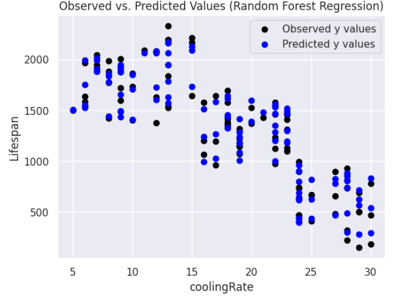

---

# Binary Classification: Defective vs Non-Defective

Binary target created as:  
- **Non-defective:** lifespan > 1500  
- **Defective:** lifespan ≤ 1500

### Performance Summary

| Model | Accuracy | Precision | Recall | F1 |
|--------|----------|------------|---------|------|
| Logistic Regression | 0.81 | 0.79 | 0.81 | 0.81 |
| SVM | 0.88 | 0.84 | 0.90 | 0.88 |
| Naive Bayes | 0.79 | 0.79 | 0.74 | 0.79 |
| KNN | 0.88 | 0.84 | 0.90 | 0.88 |
| Decision Tree | 0.96 | 0.93 | 0.98 | 0.96 |
| **Random Forest** | **0.96** | **0.95** | **0.95** | **0.96** |

### Confusion Matrix
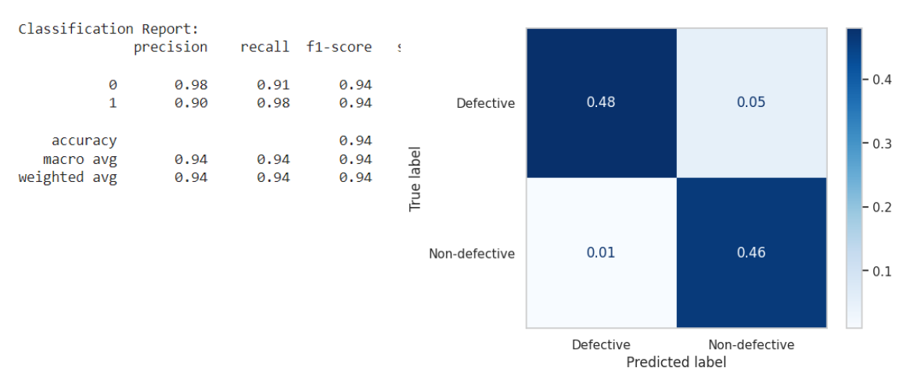

### Baseline Comparison
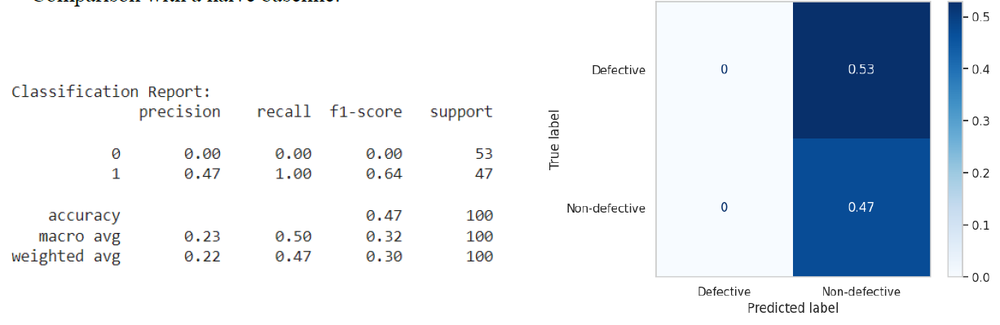

---

# Convolutional Neural Network (CNN) – Defect Image Classification

Images were:
- Loaded from filenames and labels  
- Resized to **100×100**  
- Normalised  
- Augmented in Model 2  

### Best Model
- Model 1  
- Batch size: 32  
- Epochs: 20  
- Validation accuracy: **0.93**  
- Test accuracy: **0.93**

### Training Curve


### Confusion Matrix
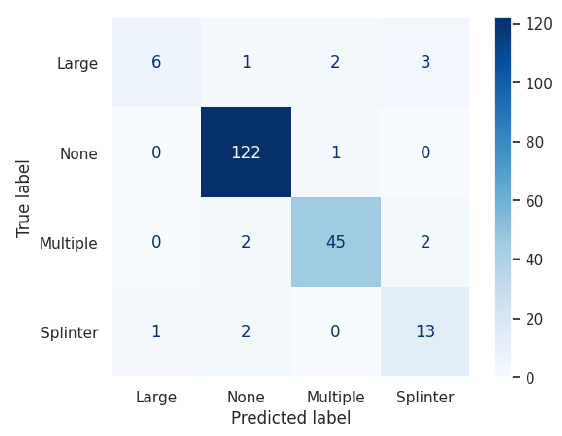

---

# Clustering (K-Means)

Used numerical features only:  
`coolingRate`, `smallDefects`, `Lifespan`

### Scatter Plot
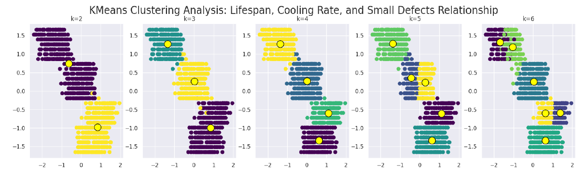

### Silhouette Scores
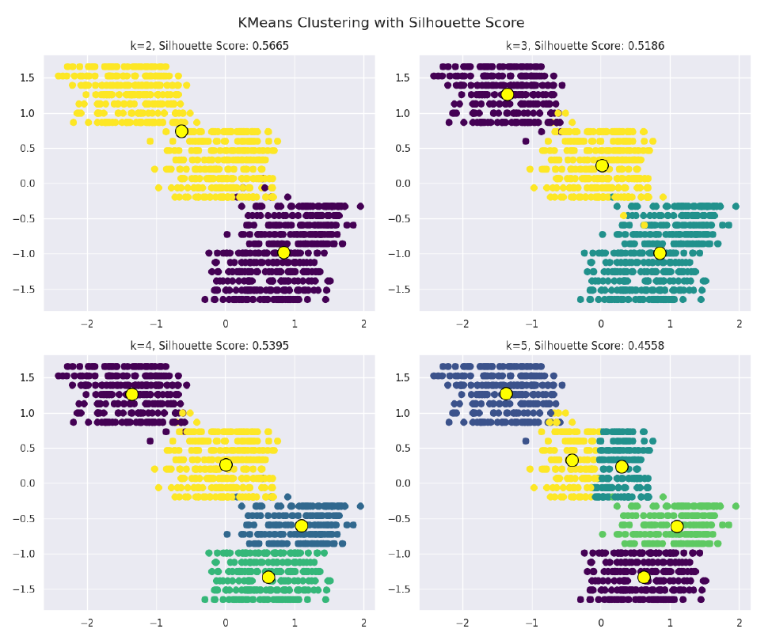

### Elbow Method
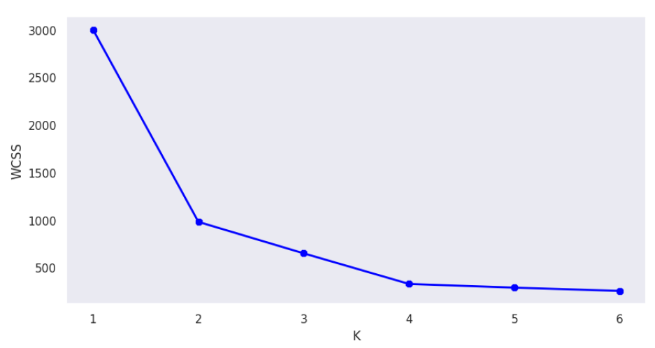

### Chosen Cluster Count: **k = 2**

### Comparison: Clustering vs Binary Classification
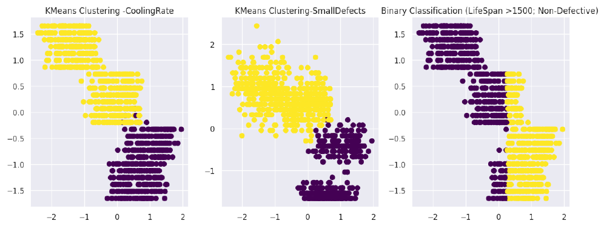

---

# Final Recommendations

### Best lifespan prediction model:
**Random Forest Regression**  
R² ≈ 0.98, low validation and test error.

### Best binary classifier:
**Random Forest Classifier**  
High precision, recall and balanced accuracy.

### Best defect image classifier:
**CNN Model 1**  
93% test accuracy, good general performance.

---

# Repository Structure

```
project/
│
├── data/
│   ├── COMP1801_CourseworkDataset1_tabular.csv
│   ├── images/
│
├── src/
│   ├── regression_models.py
│   ├── classification_models.py
│   ├── cnn_training.py
│   ├── clustering.py
│
├── plots/
│   ├── correlation_heatmap.png
│   ├── categorical_boxplots.png
│   ├── rf_regression_predictions.png
│   ├── rf_classification_cm.png
│   ├── cnn_accuracy.png
│   ├── cnn_confusion_matrix.png
│   ├── silhouette_scores.png
│   ├── elbow_plot.png
│   ├── clustering_vs_classification.png
│   └── other plots...
│
├── README.md
└── requirements.txt
```

---

# How to Run

### Install dependencies
```
pip install -r requirements.txt
```

### Run regression experiments
```
python src/regression_models.py
```

### Run classification models
```
python src/classification_models.py
```

### Train CNN model
```
python src/cnn_training.py
```

### Run clustering analysis
```
python src/clustering.py
```

---

